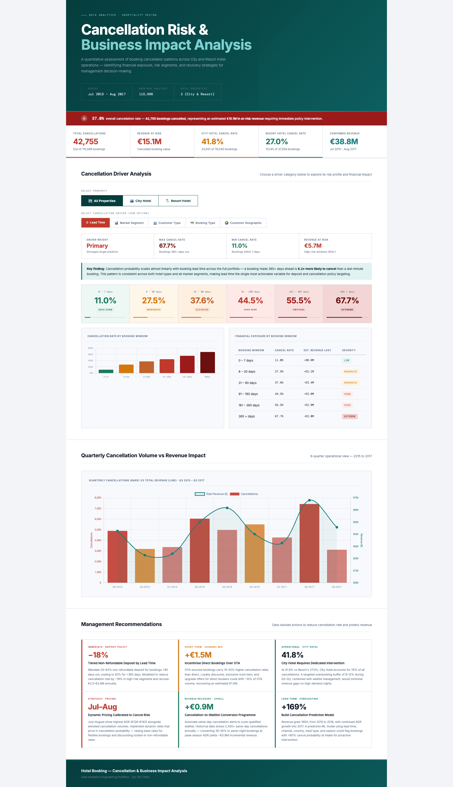
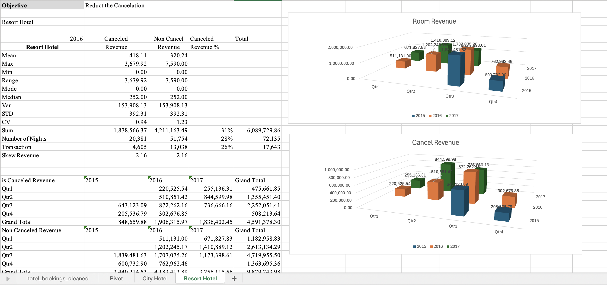
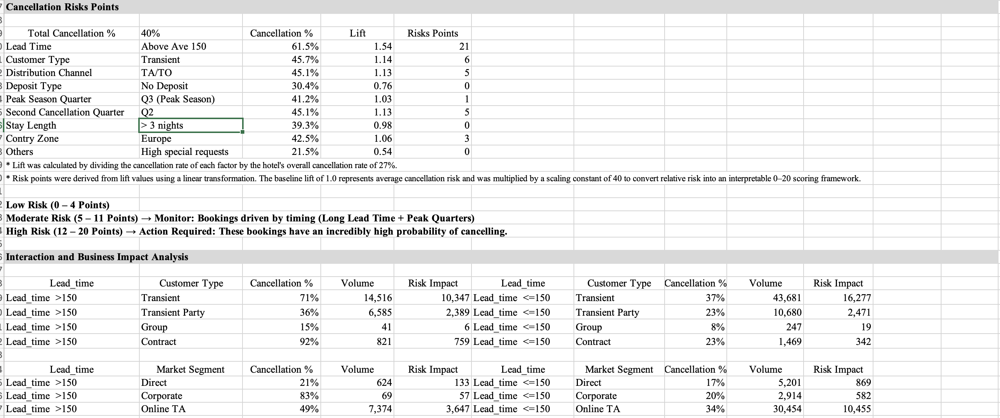
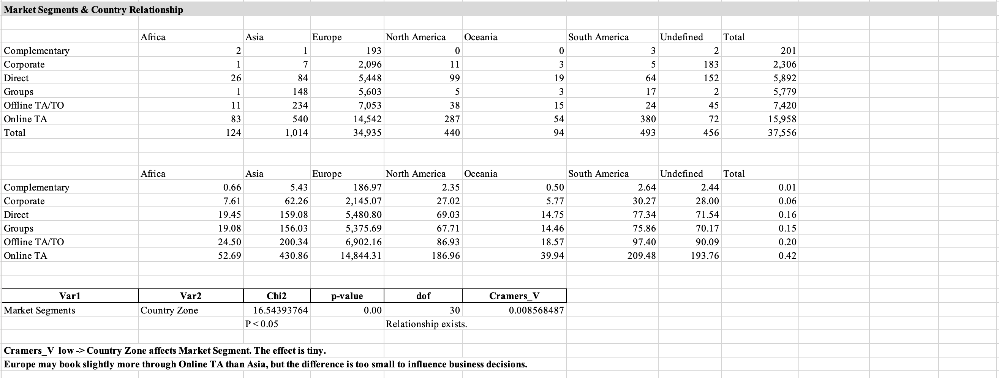

# hotel-booking-cancellation-analysis
Data analytics project leveraging Excel analysis and AI-assisted dashboard development to transform booking data into actionable business insights and decision support.

# Hotel Booking Cancellation Risk & Business Impact Analysis

## Project Overview

This project analyzes hotel booking cancellation patterns to identify key risk factors, evaluate business impact, and support data-driven decision making.

The analysis was performed using Excel-based statistical calculations and business intelligence techniques. Findings were transformed into an interactive HTML dashboard through AI-assisted development to improve visualization and stakeholder reporting.

---

## Dashboard Preview

### Executive Summary

### Statics Revenue Analysis

### Cancellation Risk Analysis

### Market Segments and Country Relationship

---

## Business Problem

Hotel booking cancellations can negatively impact occupancy rates, revenue forecasting, resource planning, and operational efficiency.

This project aims to:

- Identify factors associated with booking cancellations.
- Compare cancellation behavior between City Hotels and Resort Hotels.
- Evaluate business impact of cancellations.
- Support proactive decision-making through data-driven insights.

---

## Data Analysis Methodology

The analysis was conducted using Microsoft Excel and included:

- Data cleaning and preparation
- Descriptive statistical analysis
- Cancellation rate analysis
- Hotel performance comparison
- Business KPI calculations
- Risk factor identification
- Business impact assessment

---

## Dashboard Features

### Executive Summary

Provides a high-level overview of:

- Total Bookings
- Cancellation Rate
- Revenue Impact
- Business KPIs

### Hotel Comparison Analysis

Compares:

- City Hotel Performance
- Resort Hotel Performance
- Cancellation Trends
- Booking Patterns

### Cancellation Risk Analysis

Identifies:

- High-risk booking categories
- Cancellation behavior patterns
- Operational risk indicators

### Business Impact Analysis

Evaluates:

- Revenue impact
- Occupancy implications
- Operational planning challenges
- Business performance risks

### Interactive Filtering

Allows users to explore cancellation trends across different categories and booking segments.

---

## Key Insights

- Cancellation behavior differs significantly between hotel types.
- Certain booking categories exhibit substantially higher cancellation risk.
- Long lead-time bookings demonstrate greater cancellation probability.
- Cancellation patterns are concentrated within specific customer and booking segments.
- Proactive cancellation monitoring can improve forecasting accuracy and operational planning.

---

## Business Value

This analysis helps hotel management:

- Reduce revenue loss from cancellations.
- Improve occupancy forecasting.
- Optimize resource planning.
- Identify high-risk booking segments.
- Support data-driven operational decisions.

---

## AI-Assisted Development

This project combines traditional data analysis with AI-assisted dashboard development.

### Workflow

1. Data preparation and statistical analysis in Excel.
2. KPI definition and business insight generation.
3. Validation of analytical findings.
4. AI-assisted development of an interactive HTML dashboard based on calculated metrics and business requirements.

AI was utilized to accelerate dashboard implementation and visualization development, while analytical logic, KPI selection, business interpretation, and recommendations were independently designed and validated.

---

## Tools & Technologies

- Microsoft Excel
- Statistical Analysis
- HTML
- Data Visualization
- Business Intelligence Reporting
- AI-Assisted Development

---

## Skills Demonstrated

- Data Cleaning & Preparation
- Statistical Analysis
- KPI Development
- Business Performance Analysis
- Data Visualization
- Dashboard Design
- Data Storytelling
- Business Recommendation Development
- AI-Assisted Analytics Workflow

---

## Repository Contents

- Hotel_Booking_Dashboard.html
- Hotel_Booking_Presentation.pptx
- Dashboard Screenshots
- README.md

---

## Author

Data Analytics Portfolio Project developed to demonstrate analytical thinking, statistical analysis, business intelligence reporting, dashboard development, and AI-assisted solution delivery.
